# img
# 注册RAVVAR帐号
## 帐号注册
登录[RAVVAR - AR （增强现实）自主创作](https://www.ravvar.cn)点击右上角“制作AR”按钮开始注册帐号
## WebAR/3D在线编辑器内测申请
登录[RAVVAR WebAR/3D创意制作平台内测申请](https://labs.darseek.com/apply)申请

# WebAR/3D在线编辑器介绍
## 概述
## 具体介绍
### 新建Web3D项目

### 新建Web3D场景
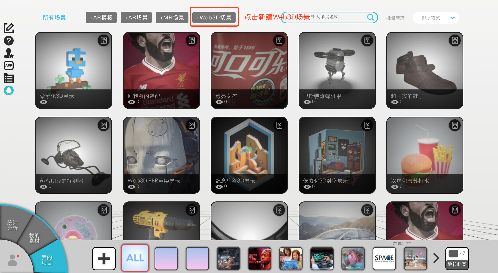

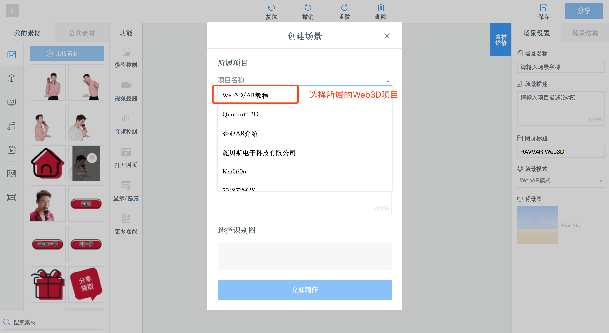

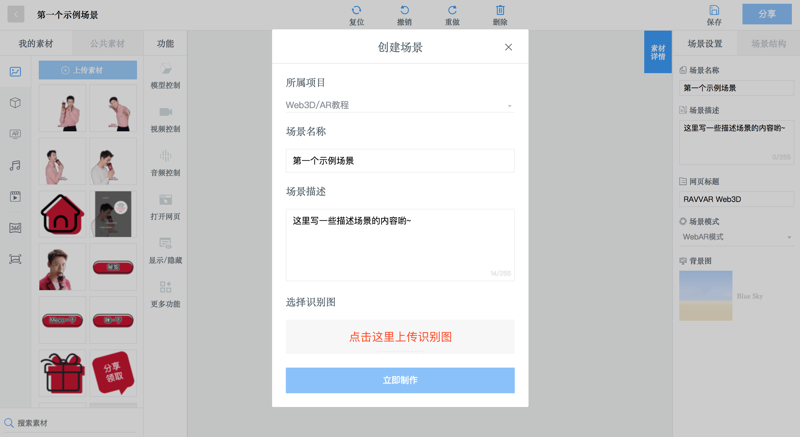

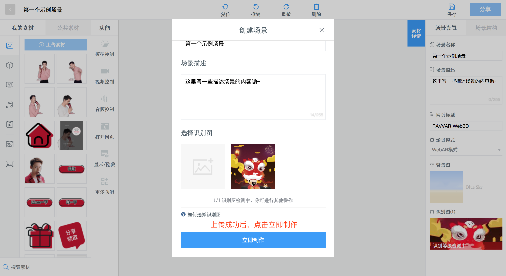

### WebAR/3D编辑器界面基础介绍

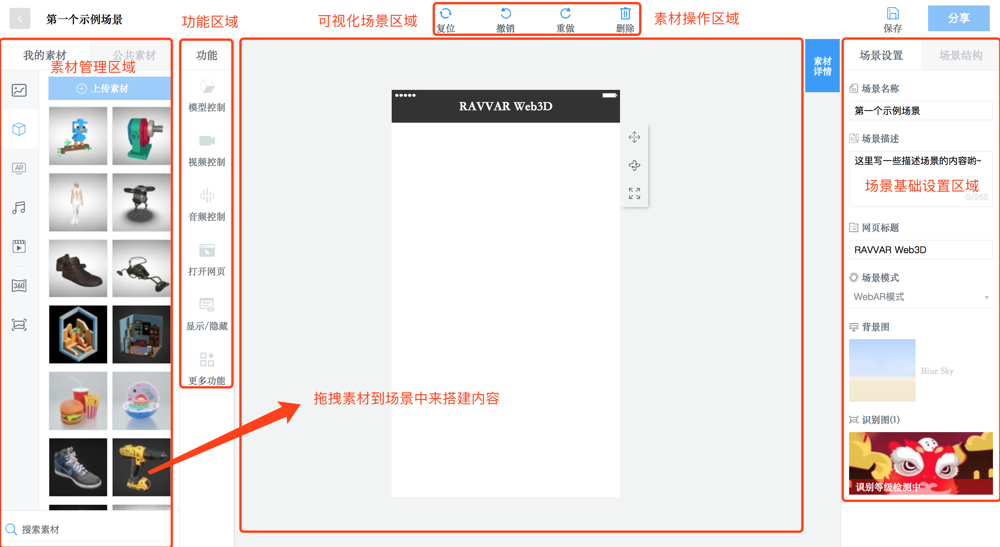

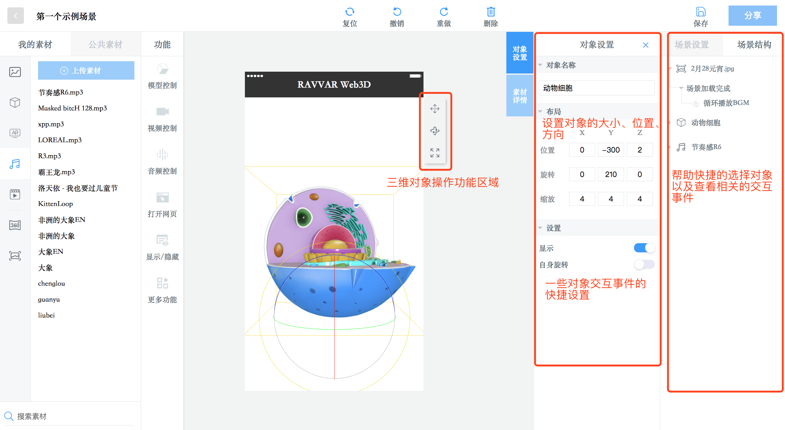

### Web3D场景设置

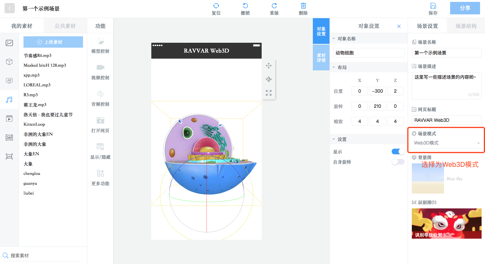

### WebAR场景设置

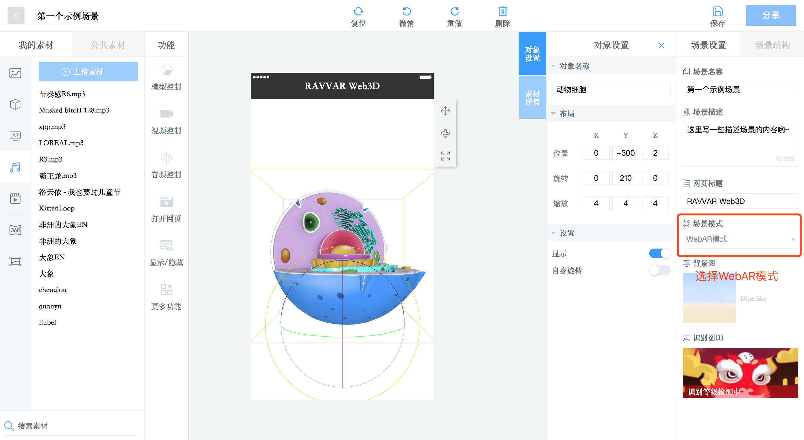

## 创建属于自己的第一个WebAR/3D场景
### 示例效果展示
**Web3D场景**：扫描如下二维码直接体验

**WebAR场景**：扫描如下二维码后再扫描识别图体验

### Web3D场景示例
#### 新建Web3D场景
#### 设定背景图片
- - - -
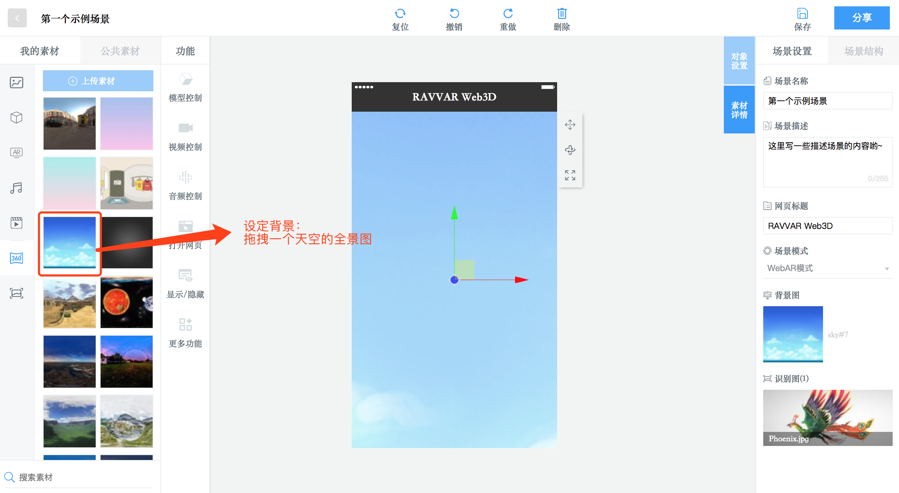

#### 上传模型并拖拽到场景中设置
- - - -

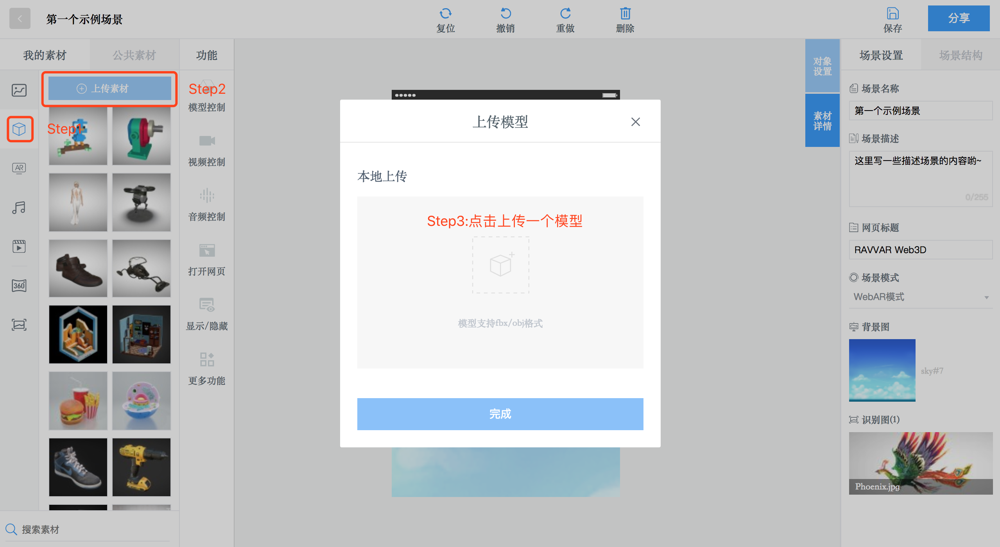

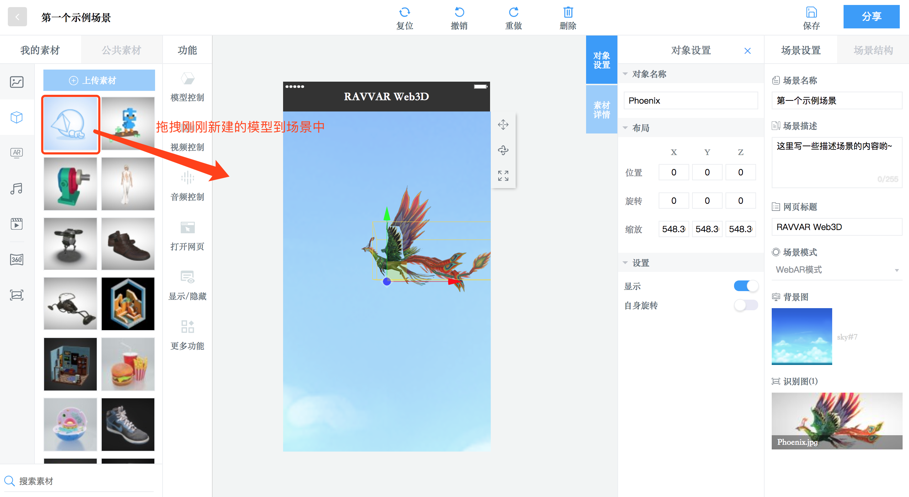

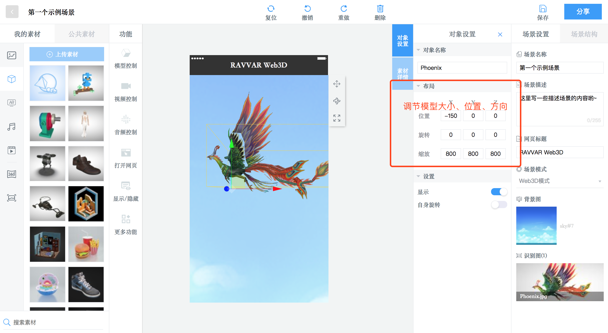

#### 设定模型交互事件：自动循环播放模型动画
- - - -

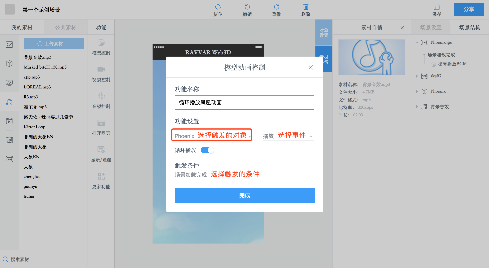

#### 上传音频并拖拽到场景中设置
- - - -
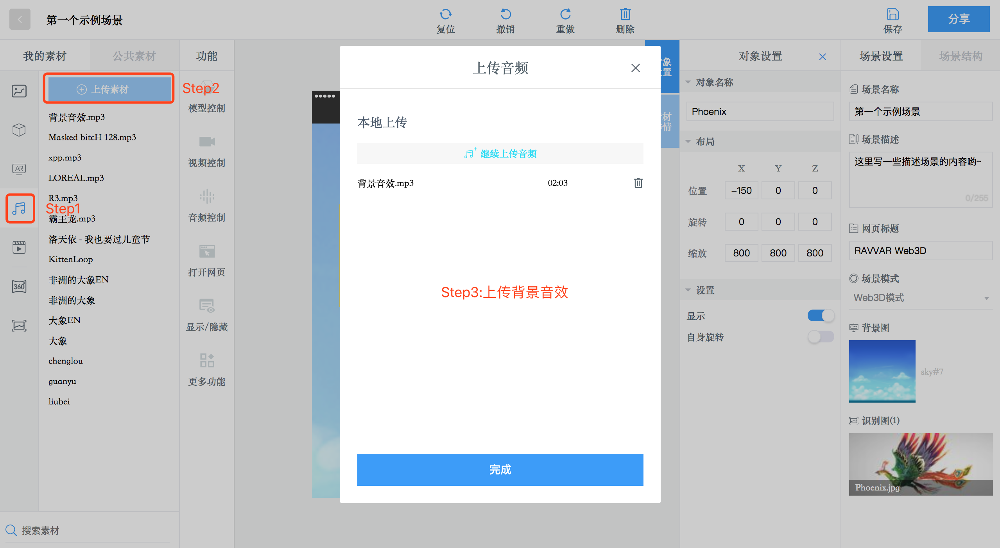

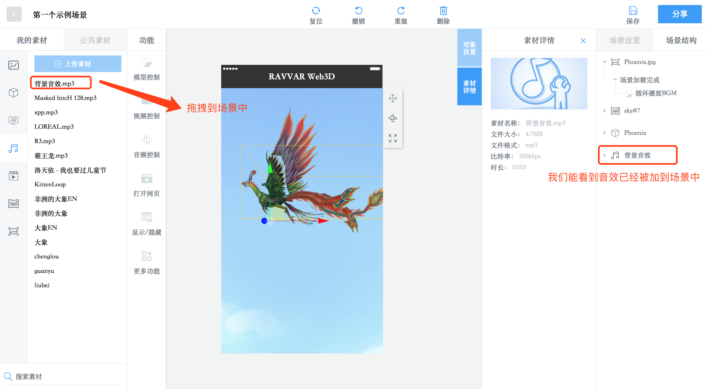

#### 设定音频交互事件：自动循环播放BGM
- - - -
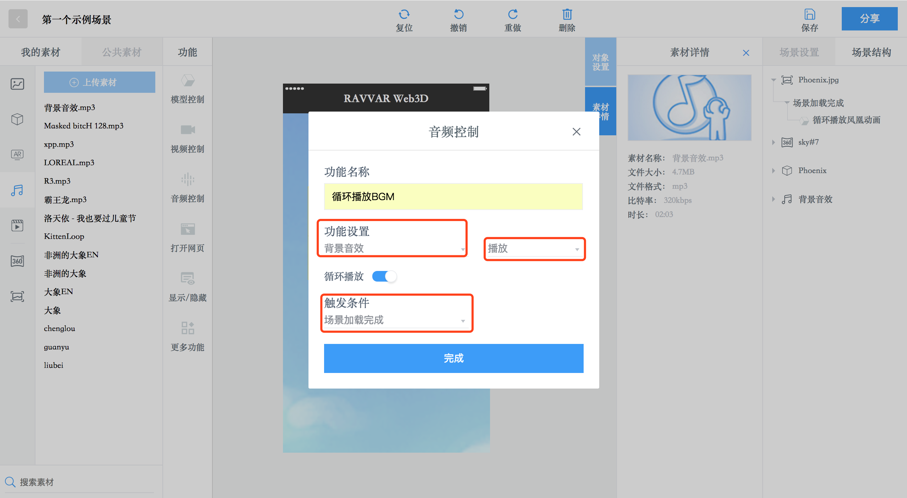

#### 场景基础设置
- - - -

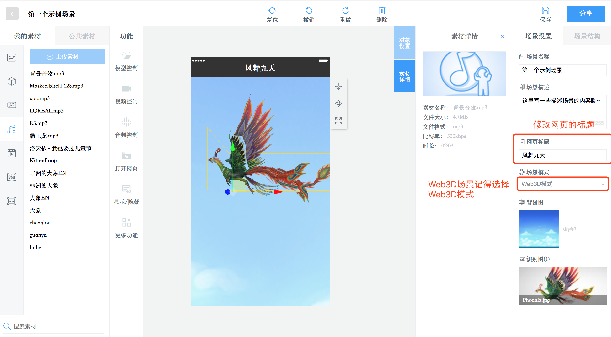

#### 分享设置
- - - -
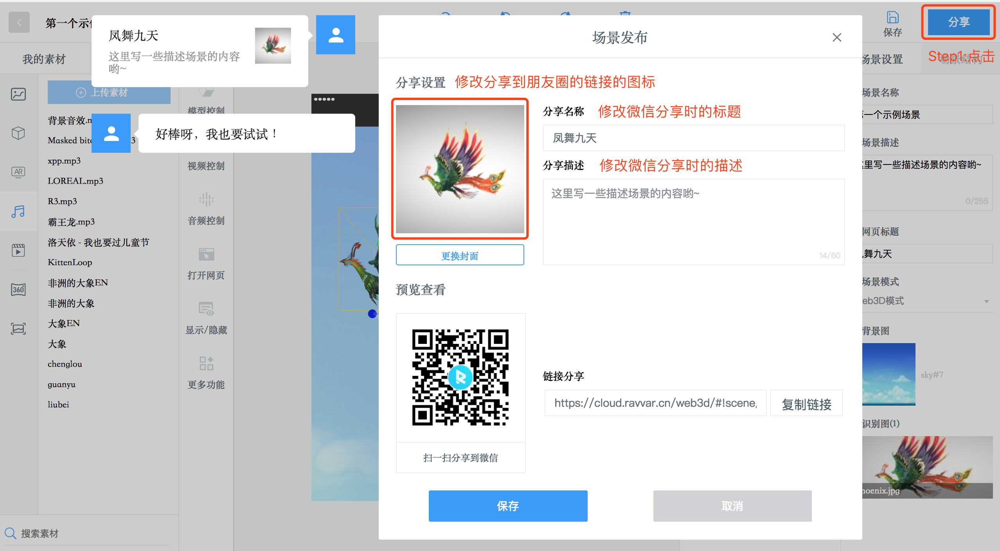

### WebAR场景示例

